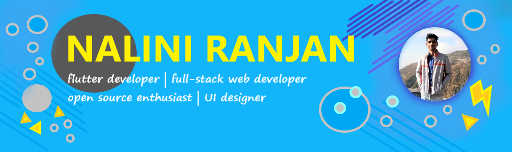

<h3>👋HI THERE,</h3>
<h4>I'm Nalini Ranjan Jatwar</h4>
<h4>4TH YEAR UG STUDENT AT IIT KHARAGPUR, INDIA</h4>

I'm a Flutter Developer,Competitive Programmer and an Open Source Enthusiast who is highly passionate about building fast,Creative applications. I also like to design wireframes and prototypes in adobe xd

🔭 I’m currently working on a Quiz Web Application

🌱 I’m currently learning node.js,typescript

🤝 I’m looking to collaborate on flutter,firebase projects or Web applications using html,css and javascript

📫 reach me by-

<!--
**nalini21/nalini21** is a ✨ _special_ ✨ repository because its `README.md` (this file) appears on your GitHub profile.

Here are some ideas to get you started:

- 🔭 I’m currently working on ...
- 🌱 I’m currently learning ...
- 👯 I’m looking to collaborate on ...
- 🤔 I’m looking for help with ...
- 💬 Ask me about ...
- 📫 How to reach me: ...
- 😄 Pronouns: ...
- ⚡ Fun fact: ...
-->
